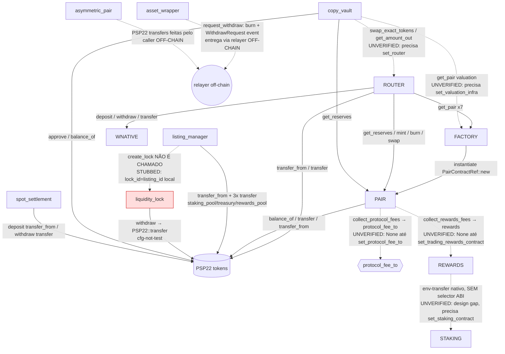

# Lunex DEX — Fluxograma de Comunicação Cross-Contrato (provado em código)

**Data:** 2026-06-16
**Regra aplicada:** nenhuma aresta inventada. Cada aresta tem `caller file:line` provado. O que não é provável é marcado `UNVERIFIED`. Stubs `#[cfg(test)]`/no-op marcados `STUBBED`.
**Fonte:** 6 especialistas read-only → `.planning/contracts-flow/01..06`. Este doc é a síntese canônica.

## Contagem global
- **Arestas distintas contrato→contrato:** 19 (deduplicadas) / ~50 call-sites granulares (cada `PSP22::transfer` contado).
- **VERIFIED:** 13 · **UNVERIFIED:** 5 · **STUBBED:** 1
- Contratos sem nenhuma chamada outbound: `staking`, `asset_wrapper`, `asymmetric_pair`, `psp22`, `wnative` (operam em nativo/host-fn ou delegam PSP22 ao caller off-chain).

---

## Diagrama

> Linha sólida = aresta on-chain provada (VERIFIED). Linha pontilhada = UNVERIFIED (wiring depende de setter admin nunca auto-chamado) ou STUBBED (não existe call) ou dependência off-chain.

---

## Arestas VERIFIED (on-chain, provadas)

| Caller (file:line) | Callee | Mensagem / selector |
|---|---|---|
| `factory::create_pair` (factory L260) | pair | `PairContractRef::new(...).instantiate()` |
| `router` add/remove/swap (router, 7 sites) | factory | `get_pair` `selector_bytes!("get_pair")` |
| `router::add_liquidity` (L660/L708) | pair | `get_reserves`, `mint` |
| `router::remove_liquidity` (L792) | pair | `burn` |
| `router::swap_tokens_for_exact_tokens` (L1015) | pair | `swap` |
| `router` (R13–R19) | psp22 | `transfer_from` / `transfer` |
| `router` (R20–R25) | wnative | `deposit` / `withdraw` / `transfer` |
| `pair` mint/burn/swap/sync/skim | psp22 | `balance_of` / `transfer` / `transfer_from` |
| `listing_manager::list_token` (L364/399/403/406) | lunes_token (psp22) | `transfer_from` + 3× `transfer` (split 20/50/30) |
| `liquidity_lock::withdraw` (L226-247, `#[cfg(not(test))]`) | psp22 lp_token | `transfer` |
| `copy_vault::swap_through_router` (L1226/L1264, `#[cfg(not(test))]`) | psp22 + router | `approve` + `swap_exact_tokens_for_tokens` |
| `copy_vault` valuation (L1877/L1929) | psp22 + pair | `balance_of` + `get_reserves` |
| `spot_settlement::deposit_psp22/withdraw_psp22` (L503/L616) | psp22 | `transfer_from` / `transfer` |
| `spot_settlement` / `staking` native payouts | — | `self.env().transfer` p/ usuário/treasury |

## Arestas UNVERIFIED (wiring dangling — risco real)

| Aresta | Por que UNVERIFIED | Impacto |
|---|---|---|
| `pair → protocol_fee_to` | `set_protocol_fee_to` (caller==factory) **nunca chamado por `factory::create_pair`** | Par novo nasce sem destino de taxa → **taxa de protocolo não coletada** |
| `pair → rewards` | `set_trading_rewards_contract` idem, nunca auto-chamado | Par novo sem rewards → **trading rewards não fluem** |
| `copy_vault → router` | `router=None` no deploy; precisa `set_router` admin | Swap do vault falha até admin setar |
| `copy_vault → factory` | `factory=None`; precisa `set_valuation_infra` | Valuation/NAV falha até admin setar |
| `rewards → staking` | `env().transfer` nativo **sem selector ABI**; comentário admite "por simplicidade vamos só transferir"; precisa `set_staking_contract` | Staking recebe LUNES sem notificação ABI → contabilidade do pool depende de timing |

## Aresta STUBBED

| Aresta | Evidência | Veredito |
|---|---|---|
| `listing_manager → liquidity_lock::create_lock` | `lib.rs:415-420`: `let lock_id = listing_id;` + comentário "off-chain relayer ... calls create_lock". `self.liquidity_lock` armazenado, nunca despachado. | **LP lock NÃO é forçado on-chain — superfície de rug-pull (B1).** |

---

## 3 verdicts de custódia/segurança (provados)

1. **Listing LP lock — NÃO forçado on-chain (B1).** `list_token` vira `Active` sem tocar `liquidity_lock`. Fix: `build_call` real pra `create_lock` + verificar recebimento do LP antes de `Ok`.
2. **asset_wrapper withdraw — NÃO forçado on-chain (B2).** `request_withdraw` queima PSP22 + emite evento; entrega do pallet-asset é extrínseca off-chain pelo relayer. Burn irreversível. Fix: escrow/claim on-chain ou janela de disputa.
3. **spot_settlement signature — ENFORCED on-chain via `ecdsa_recover` (B3 revisado).** Não é no-op. Fail-closed no deploy (`attestor_pubkey=None`). Risco residual: toggle `enforced=false` é owner-only imediato. Fix: timelock/multisig no toggle. **O bloqueador EXT-CRYPTO (`seal_sr25519_verify`) do roadmap está obsoleto — migraram pra ECDSA.**

## Pares wnative/asymmetric — totalmente on-chain ou off-chain por design
- `wnative` wrap/unwrap: 100% on-chain (`transferred_value` / `env().transfer`).
- `asymmetric_pair`: zero outbound; PSP22 transfers feitas pelo caller off-chain (por design declarado L292).
