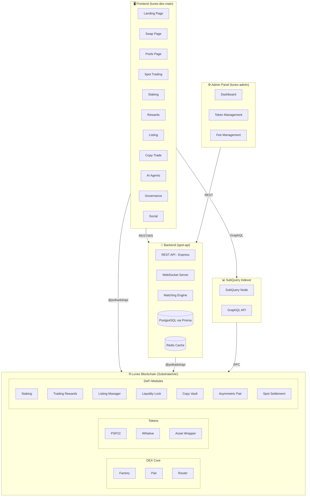
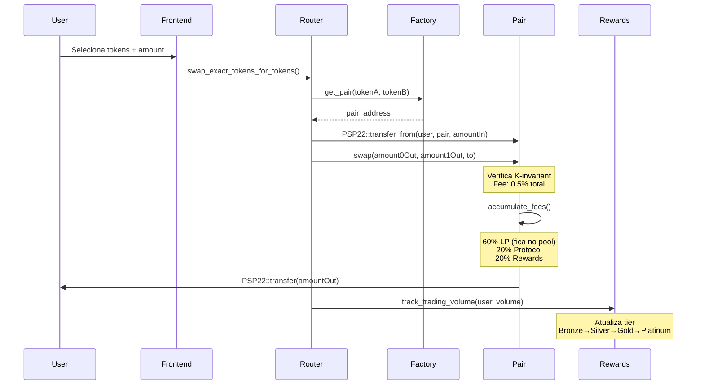
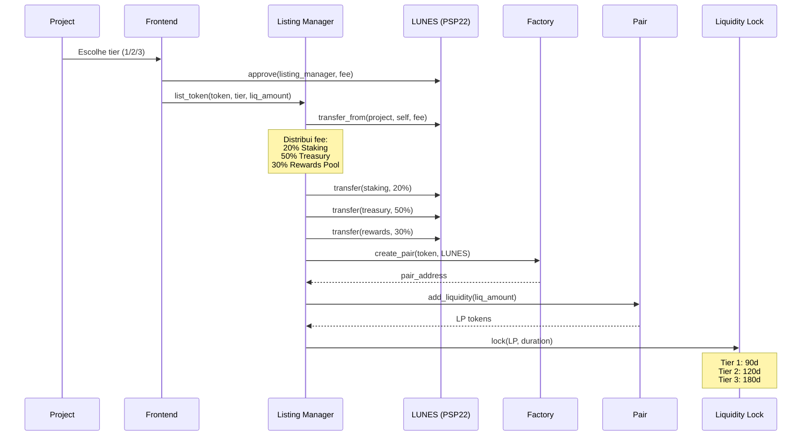
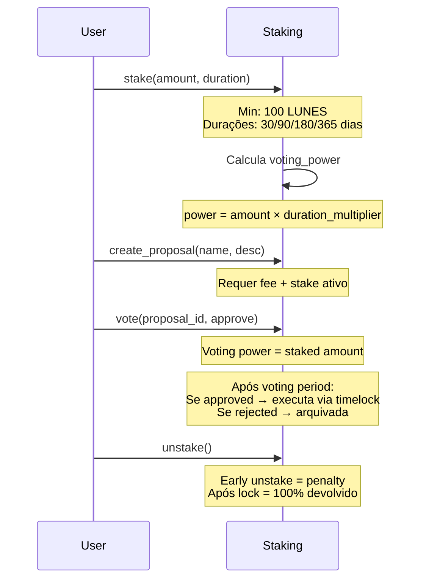
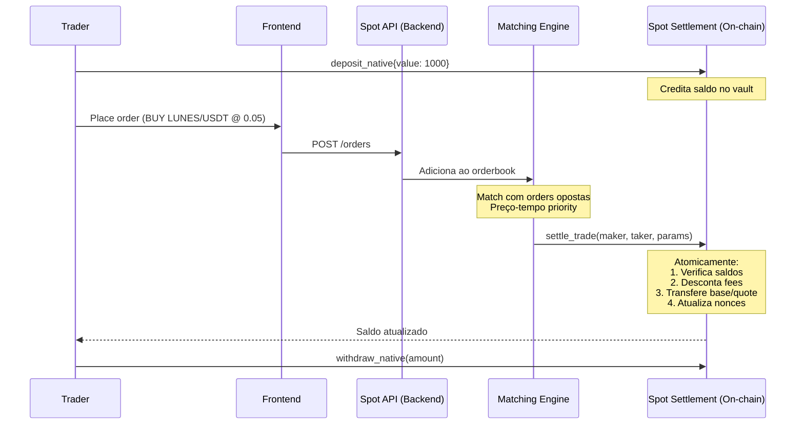
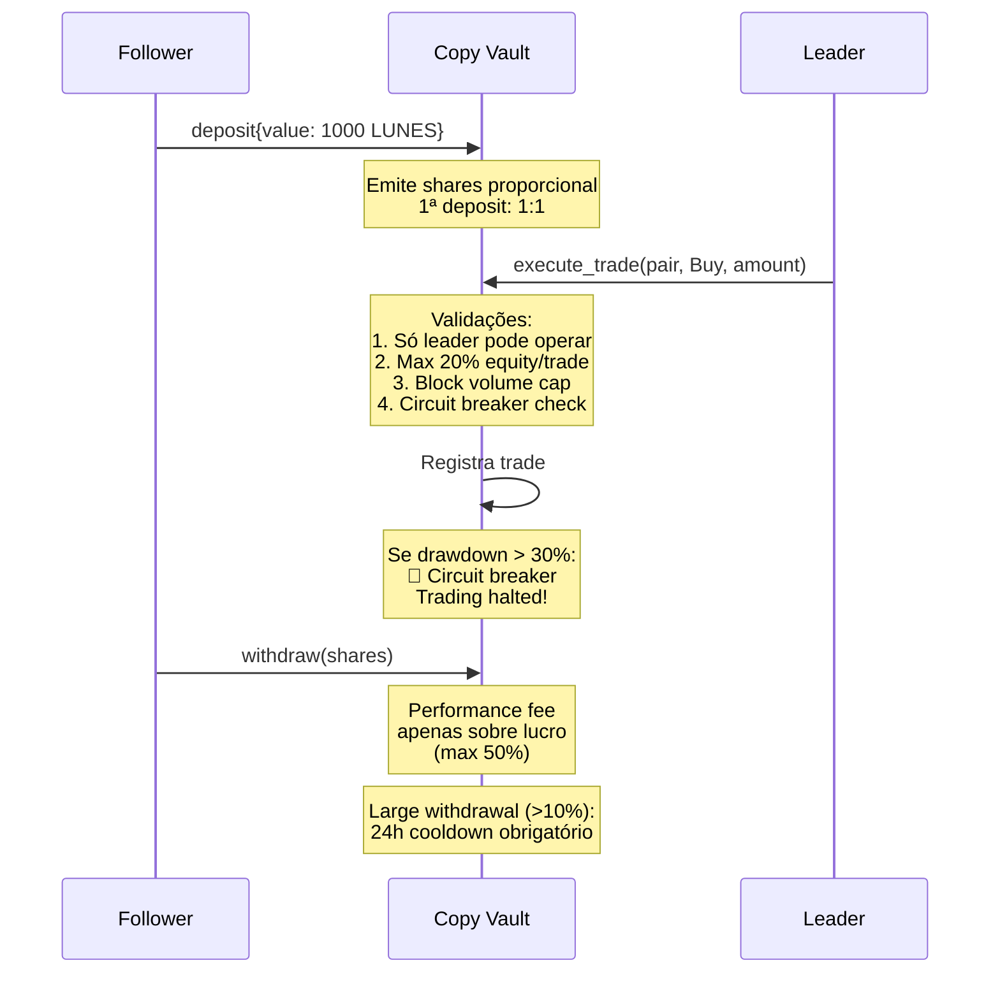
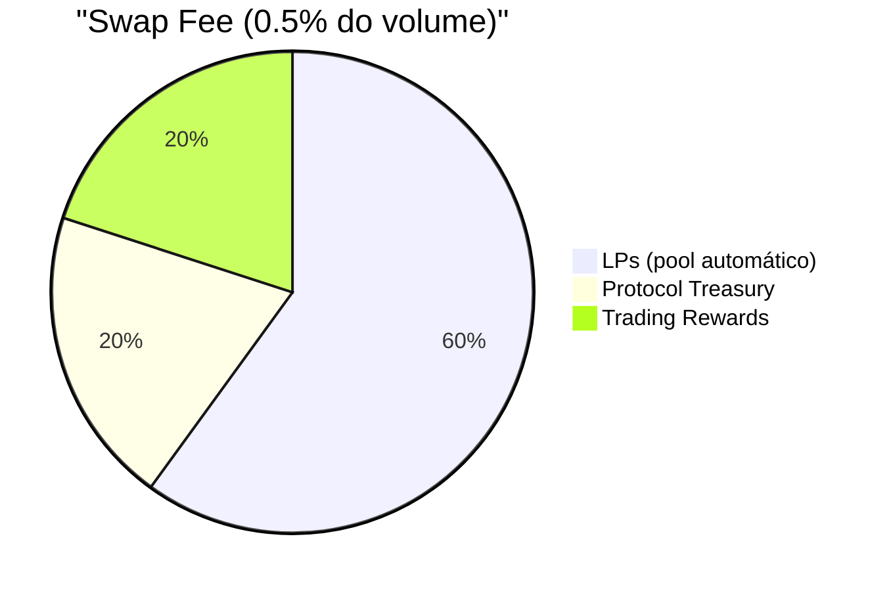
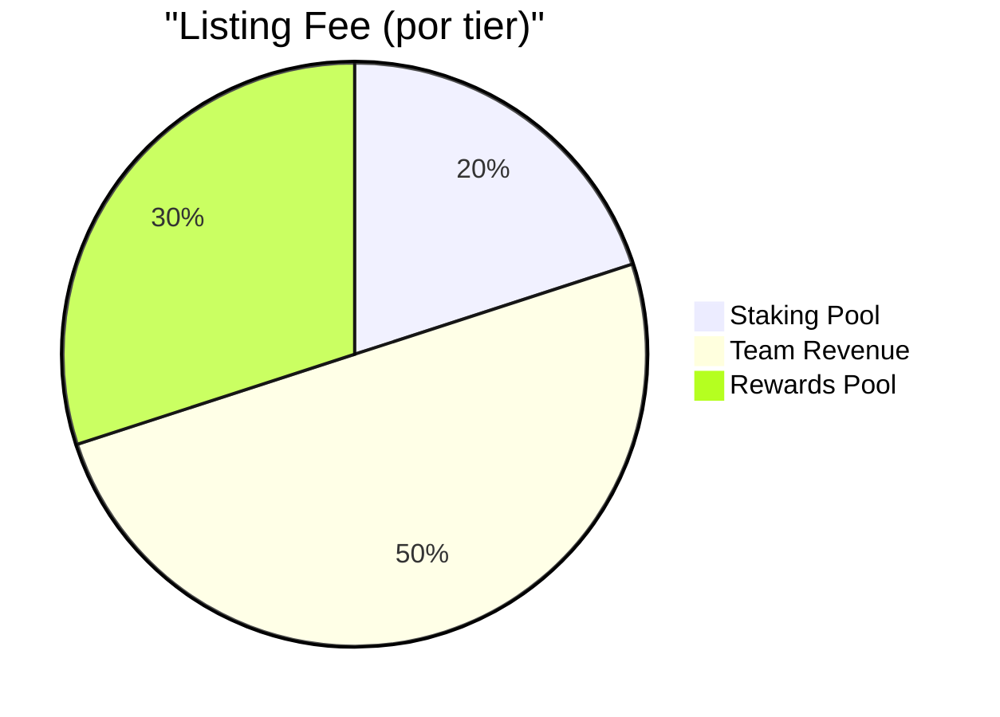
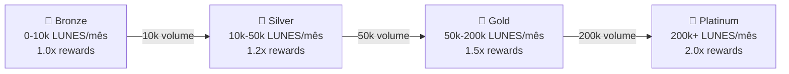

# Lunex DEX — De-Para & Arquitetura Completa

## 1. Visão Geral do Sistema

---

## 2. Contratos On-Chain (De-Para)

| # | Contrato | Diretório | Função | Depende de | Quem chama |
|---|---|---|---|---|---|
| 1 | **Factory** | `contracts/factory/` | Registra e deploya pares de tokens | Pair (code hash) | Router, Frontend |
| 2 | **Pair** | `contracts/pair/` | AMM x*y=k, LP tokens, fee accrual | PSP22 (tokens) | Router, Factory |
| 3 | **Router** | `contracts/router/` | Entry point para swaps e liquidez | Factory, Pair, PSP22 | Frontend, Backend |
| 4 | **PSP22** | `contracts/psp22/` | Token padrão fungível | — | Todos |
| 5 | **WNative** | `contracts/wnative/` | Wrapper LUNES nativo → PSP22 | — | Router |
| 6 | **Staking** | `contracts/staking/` | Stake LUNES, governance, proposals | — | Frontend, Listing Manager |
| 7 | **Trading Rewards** | `contracts/rewards/` | Track volume, epochs, tiers, claim | — | Router (track), Frontend (claim) |
| 8 | **Listing Manager** | `contracts/listing_manager/` | Cobra fee, cria pool, trava LP | PSP22, Factory, Liquidity Lock | Frontend (listing page) |
| 9 | **Liquidity Lock** | `contracts/liquidity_lock/` | Trava LP tokens por período | Pair (LP token) | Listing Manager |
| 10 | **Spot Settlement** | `contracts/spot_settlement/` | Vault + atomic trade settlement | PSP22 | Backend (matching engine) |
| 11 | **Copy Vault** | `contracts/copy_vault/` | Vault para copy trading | — | Frontend, Leader |
| 12 | **Asymmetric Pair** | `contracts/asymmetric_pair/` | Curva parametrizada V2 | — | Frontend, Manager |
| 13 | **Asset Wrapper** | `contracts/asset_wrapper/` | Bridge wrapper para ativos externos | PSP22 | Backend |

---

## 3. Fluxo de Swap (AMM)

---

## 4. Fluxo de Listagem de Token

### Regras de Negócio — Listagem

| Tier | Nome | Fee (LUNES) | Liquidez Mínima | Lock |
|:---:|---|---:|---:|---:|
| 1 | Basic | 1.000 | 10.000 | 90 dias |
| 2 | Verified | 5.000 | 25.000 | 120 dias |
| 3 | Featured | 20.000 | 50.000 | 180 dias |

---

## 5. Fluxo de Staking & Governança

---

## 6. Fluxo Spot Trading (Orderbook)

### Regras de Negócio — Spot

| Parâmetro | Valor |
|---|---|
| Maker fee | 0.10% (10 bps) |
| Taker fee | 0.25% (25 bps) |
| Depósito mínimo | 0.01 LUNES |
| Trade mínimo | 0.01 LUNES |
| Max relayers | 10 |

---

## 7. Fluxo Copy Trading

### Regras de Negócio — Copy Vault

| Parâmetro | Valor |
|---|---|
| Performance fee máxima | 50% (sobre lucro) |
| Max trade por operação | 20% do equity |
| Large withdrawal threshold | 10% das shares |
| Large withdrawal cooldown | 24 horas |
| Max drawdown (circuit breaker) | 30% |
| Emergency withdrawal delay | 48 horas |
| Depósito mínimo | 10 LUNES |

---

## 8. Distribuição de Fees

---

## 9. Trading Rewards — Tiers

### Anti-Fraude

| Mecanismo | Default |
|---|---|
| Volume mínimo/trade | 100 LUNES |
| Cooldown entre trades | 60 segundos |
| Volume máximo diário | 1.000.000 LUNES |
| Blacklist | Endereços suspeitos |
| Época de distribuição | 7 dias |

---

## 10. Frontend → Contrato (De-Para)

| Página | Rota | Contrato(s) | Ações Principais |
|---|---|---|---|
| Landing | `/` | — | Hero, métricas, CTA |
| Swap | `/home` | Router, Factory, Pair | swap, quote, approve |
| Pools | `/pools` | Factory, Pair | list pools, add/remove liq |
| Pool Detail | `/pool/:id` | Pair | get_reserves, mint, burn |
| Spot | `/spot` | Spot Settlement | deposit, withdraw, orders |
| Staking | `/staking` | Staking | stake, unstake, claim |
| Rewards | `/rewards` | Trading Rewards | get_tier, claim_rewards |
| Listing | `/listing` | Listing Manager | list_token, tier_config |
| Copy Trade | `/copytrade` | Copy Vault | deposit, withdraw, stats |
| Governance | `/governance` | Staking | proposals, vote |
| Social | `/social` | — (API) | profiles, comments, follow |
| Agents | `/agents` | — (API) | AI strategy agents |
| Strategies | `/strategies` | — (API) | social trading strategies |
| Affiliates | `/affiliates` | — (API) | referral program |
| Docs | `/docs` | — | documentation |
| Protocol Stats | `/protocolStats` | — (SubQuery) | TVL, volume, fees |

---

## 11. Backend API → Contrato (De-Para)

| API Route | Métodos | Contrato On-chain | Função |
|---|---|---|---|
| `pairs.ts` | GET/POST | Factory, Pair | Listar/criar pares |
| `orderbook.ts` | GET | — (in-memory) | Orderbook local |
| `orders.ts` | POST/DELETE | Spot Settlement | Place/cancel orders |
| `trades.ts` | GET | Spot Settlement | Histórico de trades |
| `execution.ts` | POST | Spot Settlement | settle_trade |
| `listing.ts` | POST/GET | Listing Manager | Submit/query listings |
| `governance.ts` | GET/POST | Staking | Proposals/votes |
| `rewards.ts` | GET | Trading Rewards | Tier/rewards info |
| `copytrade.ts` | GET/POST | Copy Vault | Vault stats/deposit |
| `asymmetric.ts` | GET/POST | Asymmetric Pair | Curve params |
| `social.ts` | CRUD | — (DB) | Profiles, comments |
| `strategies.ts` | CRUD | — (DB) | Trading strategies |
| `agents.ts` | CRUD | — (DB) | AI agents |
| `affiliate.ts` | GET/POST | — (DB) | Referral program |
| `candles.ts` | GET | — (SubQuery) | Price candles |
| `marketInfo.ts` | GET | — (SubQuery) | Market data |
| `tokenRegistry.ts` | GET | — (DB) | Token metadata |
| `tradeApi.ts` | POST | Router | Execute swaps |
| `router.ts` | GET | Router | Quote, path finding |
| `favorites.ts` | CRUD | — (DB) | User favorites |
| `margin.ts` | CRUD | — (DB) | Margin positions |

---

## 12. Segurança — Controles por Contrato

| Contrato | Reentrancy | Pause | Access Control | Checked Math |
|---|:---:|:---:|:---:|:---:|
| Pair | ✅ lock/unlock | ✅ | Factory-only (skim, set_*) | ✅ |
| Factory | — | — | fee_to_setter only | ✅ |
| Router | — | — | — (public) | ✅ |
| Staking | ✅ | ✅ | Admin + timelock | ✅ |
| Trading Rewards | ✅ | ✅ | Admin + router-only | ✅ |
| Spot Settlement | — | ✅ | Owner + relayers | ✅ |
| Listing Manager | — | ✅ | Admin + timelock | ✅ |
| Copy Vault | ✅ | ✅ | Leader + admin | ✅ |
| Asymmetric Pair | — | — | Owner + manager (guardrails) | ✅ |

---

## 13. Stack Tecnológica

| Camada | Tecnologia | Versão |
|---|---|---|
| Blockchain | Substrate (Lunes Nightly) | Polkadot v0.9.40 |
| Smart Contracts | ink! | 4.3.0 |
| Token Standard | PSP22 (local) | Compatible w/ ink! 4.x |
| Frontend | React + TypeScript | CRA |
| Admin Panel | Next.js + shadcn/ui | 14.x |
| Backend API | Express + TypeScript | 4.x |
| Database | PostgreSQL + Prisma | 7.x |
| Cache | Redis | — |
| Indexer | SubQuery | — |
| Blockchain Client | @polkadot/api | 10.x |
| Testing | cargo test (Rust), Jest (TS) | — |
