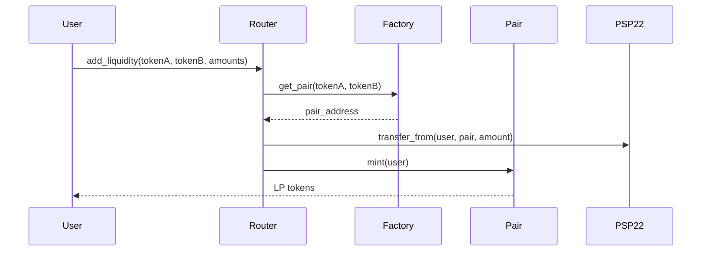
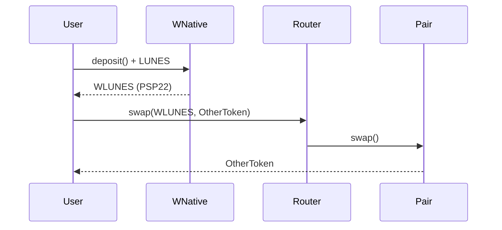

# 📋 PRD: Integração com Lunes Blockchain - Native Assets

## 📊 Informações da Rede Lunes

### 🌐 Endpoints WebSocket (Mainnet)

| Endpoint | Status | Descrição |
|----------|--------|-----------|
| `wss://ws.lunes.io` | ✅ Online | Endpoint principal |
| `wss://ws-lunes-main-01.lunes.io` | ✅ Online | Node principal 01 |
| `wss://ws-lunes-main-02.lunes.io` | ✅ Online | Node principal 02 |
| `wss://ws-archive.lunes.io` | ✅ Online | Node de arquivo (histórico completo) |

### ⚙️ Especificações da Chain

```json
{
  "chain": "Lunes Nightly",
  "specName": "lunes-nightly",
  "specVersion": 107,
  "implVersion": 2,
  "ss58Format": 57,
  "tokenDecimals": 8,
  "tokenSymbol": "LUNES",
  "transactionVersion": 2,
  "stateVersion": 2
}
```

### 📦 Métodos RPC Disponíveis (98 métodos)

#### Agrupamento por Categoria:

| Categoria | Métodos | Uso Principal |
|-----------|---------|---------------|
| **system** | 20 | Info do node, chain, health |
| **state** | 23 | Storage, metadata, runtime |
| **chain** | 19 | Blocos, headers, subscriptions |
| **chainHead** | 11 | Operações unstable de chain |
| **author** | 9 | Submissão de extrinsics |
| **childstate** | 7 | Child storage (contratos) |
| **payment** | 2 | Fees e query info |
| **transaction** | 2 | Submit/watch transactions |
| **offchain** | 2 | Storage local |
| **account** | 1 | Next index de conta |

---

## 🎯 Arquitetura de Assets

### Tipos de Tokens Suportados

```
┌─────────────────────────────────────────────────────────────┐
│                    LUNES BLOCKCHAIN                         │
│                   (Substrate-based)                         │
├─────────────────────────────────────────────────────────────┤
│                                                             │
│  1️⃣ TOKEN NATIVO (LUNES)                                   │
│     └── Gerenciado pelo pallet Balances                     │
│     └── 8 decimais                                          │
│     └── SS58 Format: 57                                     │
│                                                             │
│  2️⃣ SMART CONTRACTS (ink! / PSP22)                         │
│     └── Gerenciado pelo pallet Contracts                    │
│     └── Deploy via cargo-contract                           │
│     └── Padrão PSP22 para fungíveis                         │
│                                                             │
│  3️⃣ ASSETS NATIVOS (se pallet-assets existir)              │
│     └── Criação direta no runtime                           │
│     └── Issue/Reissue/Transfer nativos                      │
│     └── Sem necessidade de smart contract                   │
│                                                             │
└─────────────────────────────────────────────────────────────┘
```

---

## 🔧 Integração Lunex DEX

### Fluxo para Tokens PSP22 (Smart Contracts)



### Fluxo para LUNES Nativo (via WNative)



---

## 📋 Métodos RPC Relevantes

### Para Operações com Contratos

```javascript
// Submeter extrinsic (deploy, call)
author_submitExtrinsic(extrinsic) 
author_submitAndWatchExtrinsic(extrinsic)

// Query de estado
state_getStorage(key)
state_call(method, data)

// Fees
payment_queryInfo(extrinsic)
payment_queryFeeDetails(extrinsic)
```

### Para Monitoramento

```javascript
// Subscriptions em tempo real
chain_subscribeNewHeads()
chain_subscribeFinalizedHeads()
state_subscribeStorage(keys)

// Health e status
system_health()
system_syncState()
system_peers()
```

---

## 🚀 Implementação Recomendada

### Fase 1: Tokens PSP22 (Atual)
- ✅ Factory, Pair, Router deployados
- ✅ WNative para wrap/unwrap LUNES
- ✅ Staking e Trading Rewards
- ✅ Governança para listing

### Fase 2: Assets Nativos (Futuro)
Se o pallet-assets estiver disponível:
1. Criar wrappers PSP22 para assets nativos
2. Implementar bridge entre native ↔ PSP22
3. Permitir listing de assets nativos no DEX

### Fase 3: Cross-Chain
1. Integrar com bridges existentes
2. Suportar tokens de outras chains
3. Atomic swaps

---

## 📊 Configuração de Rede para SDK

```typescript
// sdk/src/config/networks.ts

export const LUNES_NETWORKS = {
  mainnet: {
    name: 'Lunes Mainnet',
    endpoints: [
      'wss://ws.lunes.io',
      'wss://ws-lunes-main-01.lunes.io',
      'wss://ws-lunes-main-02.lunes.io'
    ],
    archiveNode: 'wss://ws-archive.lunes.io',
    ss58Format: 57,
    tokenDecimals: 8,
    tokenSymbol: 'LUNES',
    specVersion: 107,
    explorer: 'https://explorer.lunes.io'
  },
  testnet: {
    name: 'Lunes Testnet',
    endpoints: [
      'wss://ws-test.lunes.io'
    ],
    ss58Format: 57,
    tokenDecimals: 8,
    tokenSymbol: 'LUNES'
  }
};

export const CONTRACT_ADDRESSES = {
  mainnet: {
    factory: 'TBD',
    router: 'TBD',
    wnative: 'TBD',
    staking: 'TBD',
    tradingRewards: 'TBD'
  }
};
```

---

## 🔐 Considerações de Segurança

### Endpoints
- ✅ Todos endpoints usam WSS (criptografado)
- ✅ Múltiplos endpoints para redundância
- ✅ Node de arquivo para queries históricas

### Recomendações
1. **Load Balancing**: Usar múltiplos endpoints
2. **Retry Logic**: Fallback entre endpoints
3. **Health Checks**: Monitorar `system_health`
4. **Rate Limiting**: Respeitar limites do node

---

## 📅 Última Atualização

- **Data**: 2025-12-05
- **Versão Runtime**: lunes-nightly v107
- **Node Version**: 4.0.0-dev
